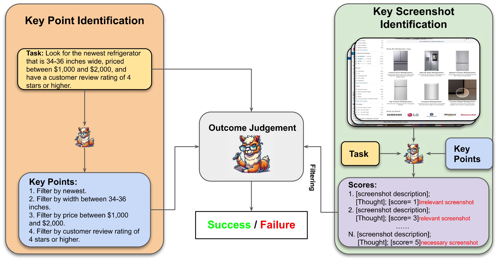

<h1 align="center"> Online-Mind2Web Benchmark </h1>

<p align="center">
  <a href="https://xuetianci.github.io/" style="text-decoration: none;">Tianci Xue<sup>,1</sup></a>, 
  <a href="https://x.com/weijian_qi" style="text-decoration: none;">Weijian Qi<sup>*,1</sup></a>,
  <a href="https://tnshi.com/" style="text-decoration: none;">Tianneng Shi<sup>*2</sup></a>,
  <a href="https://chanh.ee/" style="text-decoration: none;">Chan Hee Song<sup>1</sup></a>,
  <a href="https://boyugou.github.io/" style="text-decoration: none;">Boyu Gou<sup>1</sup></a>,
  <a href="https://dawnsong.io/" style="text-decoration: none;">Dawn Song<sup>,2</sup></a>,
  <a href="https://u.osu.edu/ihudas/people/" style="text-decoration: none;">Huan Sun<sup>†,1</sup></a>
  <a href="https://ysu1989.github.io/" style="text-decoration: none;">Yu Su<sup>†,1</sup></a>
</p>

<p align="center">
  <sup>1</sup>The Ohio State University, <sup>2</sup>University of California, Berkeley </br>
  <sub><sup>*</sup>Equal contribution, <sup>†</sup>Equal advising</sub>
</p>

<p align="center">
<a href="https://arxiv.org/abs/2504.01382">📃 Paper</a>
•
<a href="https://tiancixue.notion.site/An-Illusion-of-Progress-Assessing-the-Current-State-of-Web-Agents-1ac6cd2b9aac80719cd6f68374aaf4b4?pvs=4">📃 Blog</a>
•
<a href="https://huggingface.co/spaces/osunlp/Online_Mind2Web_Leaderboard" >🏆 Leaderboard</a>
•
<a href="https://huggingface.co/datasets/osunlp/Online-Mind2Web" >🤗 Data</a>
</p>


# Online-Mind2Web benchmark

## Tasks
Online-Mind2Web includes 300 diverse tasks from 136 popular websites across various domains. It covers a diverse set of real-world user tasks, such as clothing, food, housing, and transportation, to evaluate web agents' performance in a real-world online environment.

If you find any tasks are outdated, please reach out to us, and we will update them.

## Automatic Evaluator via LLM-as-a-Judge
To enhance the reliability and scalability of the evaluation process in online environments, We propose a more reliable automatic evaluation method, which consists of three parts. (1) Key Point Identification: The model is prompted to identify several key points necessary for completing the task, based on the given instruction and task description. (2) Key Screenshot Identification: Important screenshots are selected from the agent’s trajectory to retain relevant visual evidence while discarding uninformative frames. (3) Outcome Judgment: Output the judgement result based on the task description, key points, key screenshots, and the action history. Our method preserves critical intermediate screenshots while mitigating the token overload issue.

<p align="center">
  
</p>

# Setup Environment

Create a conda environment and install dependencies:
```
conda create -n Online_Mind2Web python=3.11
conda activate Online_Mind2Web
pip install -r requirements.txt
```

# Evaluation
You can run the provided example evaluation script directly to perform the evaluation. Adjust the "mode" parameter to choose among various auto-eval methods.
```bash
bash ./script/eval.sh
```

# Evaluation Results

In certain scenarios, testing on the full Online-Mind2Web dataset may not be feasible due to cost, privacy, or legal constraints. To facilitate fair and apple-to-apple comparisons, we release both our human evaluation labels and auto-eval details.

- **Human Evaluation**: Task-level human evaluation labels are provided in the [file](https://github.com/OSU-NLP-Group/Online-Mind2Web/tree/main/data/human_label.json).
- **Auto-Evaluation**: The results of WebJudge are available in the [folder](https://github.com/OSU-NLP-Group/Online-Mind2Web/tree/main/data/evaluation_results).

## 📚 Citation

Note: Online-Mind2Web is derived from the original Mind2Web dataset. We kindly ask that you cite both the original and this work when using or referencing the data.
```
@article{xue2025illusionprogressassessingcurrent,
      title={An Illusion of Progress? Assessing the Current State of Web Agents}, 
      author={Tianci Xue and Weijian Qi and Tianneng Shi and Chan Hee Song and Boyu Gou and Dawn Song and Huan Sun and Yu Su},
      year={2025},
      eprint={2504.01382},
      archivePrefix={arXiv},
      primaryClass={cs.AI},
      url={https://arxiv.org/abs/2504.01382}, 
}

@inproceedings{deng2023mind2web,
 author = {Deng, Xiang and Gu, Yu and Zheng, Boyuan and Chen, Shijie and Stevens, Sam and Wang, Boshi and Sun, Huan and Su, Yu},
 booktitle = {Advances in Neural Information Processing Systems},
 editor = {A. Oh and T. Naumann and A. Globerson and K. Saenko and M. Hardt and S. Levine},
 pages = {28091--28114},
 publisher = {Curran Associates, Inc.},
 title = {Mind2Web: Towards a Generalist Agent for the Web},
 url = {https://proceedings.neurips.cc/paper_files/paper/2023/file/5950bf290a1570ea401bf98882128160-Paper-Datasets_and_Benchmarks.pdf},
 volume = {36},
 year = {2023}
}
```
